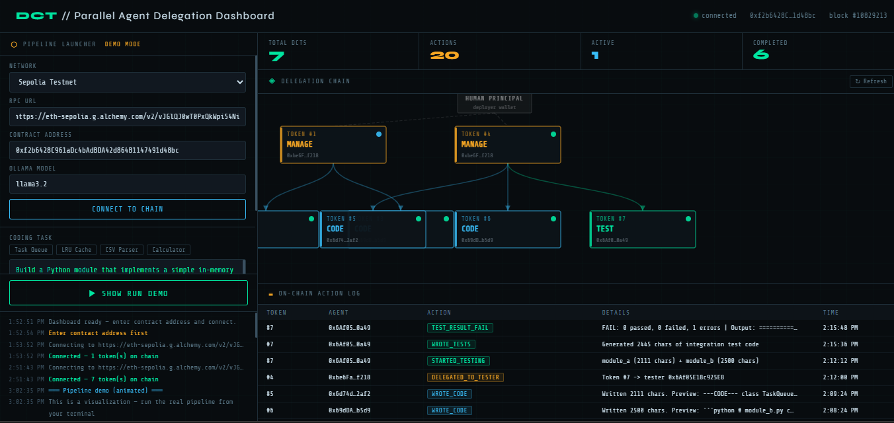

# Delegation Capability Token — Blockchain Audit Trail for AI Agents

Implementation of DCTs from "Intelligent AI Delegation" (Tomasev et al., 2026)
combined with a real LangChain multi-agent pipeline. All LLM inference uses
**Ollama** (local, free, no API key required).

## What this builds

```
Human Principal
    │  mints MANAGE token
    ▼
Manager Agent (LangChain + Ollama)
    │  splits task into 2 subtasks
    ├──────────────────────────────┐
    │  mints CODE token (Module A) │  mints CODE token (Module B)
    ▼                              ▼
Coder Agent A  ◄── parallel ──► Coder Agent B
(LangChain + Ollama)            (LangChain + Ollama)
    │  writes module_a.py           writes module_b.py
    └──────────────┬───────────────┘
                   │  both complete; Manager mints TEST token
                   ▼
           Tester Agent (LangChain + Ollama)
               runs pytest integration tests, logs pass/fail on-chain
```

Every delegation, action, and result is permanently logged on-chain.
The full audit trail is reconstructable from any leaf token.

## Core invariant enforced by the smart contract

A delegatee **cannot grant more authority than they hold**.
- MANAGE (0) is the broadest scope — can delegate to CODE or TEST
- CODE (1) can delegate to TEST only
- TEST (2) cannot delegate at all

Attempting to escalate scope reverts with `"Scope escalation denied"`.

## Setup

### Prerequisites
- Node.js 18+
- Python 3.11+
- [Ollama](https://ollama.com) installed and running locally

### 1. Install JS dependencies

```bash
npm install
```

### 2. Install Python dependencies

```bash
pip install -r requirements.txt
```

### 3. Pull the Ollama model

```bash
ollama pull llama3.2
```

To use a different model, set `OLLAMA_MODEL=<name>` in your environment.

### 4. Start local Hardhat node (Terminal 1)

```bash
npx hardhat node
```

Leave this running. It gives you a local Ethereum node with 20 pre-funded accounts.

### 5. Deploy the contract (Terminal 2, run once)

```bash
npx hardhat run scripts/deploy.cjs --network localhost
```

This compiles `DelegationRegistry.sol` and writes the deployed address + ABI to
`abi/DelegationRegistry.json`. The Python agents read from this file.

### 6. Run the pipeline (Terminal 2)

```bash
python agents/run_pipeline.py
```

## Customizing the task

Edit `CODING_TASK` at the top of `agents/run_pipeline.py`. The pipeline will:
1. Have the Manager split the task into two parallel subtasks
2. Have Coder A and Coder B implement their modules simultaneously
3. Have the Tester write and run pytest integration tests across both modules
4. Print the full on-chain audit trail

## Project structure

```
dct-project/
├── contracts/
│   └── DelegationRegistry.sol   # The smart contract
├── scripts/
│   └── deploy.cjs               # Hardhat deploy script
├── abi/
│   └── DelegationRegistry.json  # ABI + address (generated on deploy)
├── agents/
│   ├── dct_client.py            # Web3 wrapper for contract interaction
│   ├── manager_agent.py         # Splits task, delegates to 2 Coders
│   ├── coder_agent.py           # Writes one module (runs in parallel)
│   ├── tester_agent.py          # Integration tests across both modules
│   └── run_pipeline.py          # Main entry point
├── docs/
│   └── index.html               # Live dashboard (hosted on GitHub Pages)
├── dct_dashboard.html           # Local dashboard
├── requirements.txt
├── walletScript.py              # Generate Sepolia wallet keys
├── hardhat.config.cjs
└── package.json
```

## Smart contract key functions

| Function | Who calls it | What it does |
|---|---|---|
| `mintRoot()` | Human/deployer | Issues root MANAGE token to Manager |
| `delegate()` | Any token holder | Sub-delegates with narrower scope |
| `recordAction()` | Token holder | Logs an action against their token |
| `complete()` | Token holder | Marks their token done |
| `getChain(tokenId)` | Anyone | Reconstructs full delegation chain |
| `getChildTokens(parentId)` | Anyone | Lists direct children of a token |
| `getAllActions()` | Anyone | Returns full audit log |

## Key design decisions

**Why blockchain?** The agents in this pipeline could come from different
operators who don't inherently trust each other. An immutable on-chain record
means no single party can retroactively modify the audit trail.

**Why not just a database?** A database requires trusting whoever controls it.
Blockchain gives you tamper-proof accountability without a trusted third party.

**Scope as an ordered enum** makes privilege escalation a simple integer
comparison enforced at the contract level, not at the application level.

**Parallel coders** demonstrate that DCTs scale to fan-out delegation: the Manager
mints independent CODE tokens for each subtask, and both agents work simultaneously.
The on-chain record shows all child tokens, their actions, and their completion status.

**Why Ollama?** The pipeline is fully open-source with no API keys or paid services
required. Any model supported by Ollama works — swap via `OLLAMA_MODEL=<name>`.

## Using the Dashboard

`dct_dashboard.html` is a browser-based UI for inspecting the delegation tree and audit log without writing any code.

### Local (Hardhat)

1. Start the Hardhat node and deploy the contract (steps 4–5 above)
2. Open `dct_dashboard.html` directly in your browser
3. Select **Local** from the network dropdown
4. Paste the contract address from `abi/DelegationRegistry.json`
5. Click **Connect to Chain** — the delegation tree and action log will populate live

### Sepolia (public, shareable)

The `docs/index.html` version is identical but hosted on GitHub Pages so anyone can view it without running anything locally.

1. Deploy to Sepolia and run the pipeline
2. Open the GitHub Pages URL (e.g. `https://yourusername.github.io/BlockchainProject`)
3. Enter any public Sepolia RPC URL (e.g. from [Alchemy](https://alchemy.com) or [Infura](https://infura.io))
4. Paste the deployed contract address
5. Click **Connect to Chain**

The dashboard auto-refreshes every 15 seconds and shows:
- Full delegation tree (root → coders → tester) with token status (active / completed / revoked)
- Per-token action log with timestamps
- Total DCTs minted and actions recorded

## Sepolia testnet deployment

```bash
# 1. Generate wallets
python walletScript.py   # copy output into .env

# 2. Fund deployer at https://sepoliafaucet.com

# 3. Deploy
npx hardhat run scripts/deploy.cjs --network sepolia

# 4. Run
NETWORK=sepolia python agents/run_pipeline.py
```